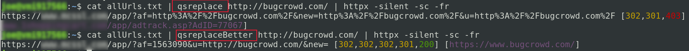

chmod +x qsreplaceBetter

sudo cp ./qsreplaceBetter /usr/bin/

cat allUrls.txt | grep "=" | grep -v "==" | qsreplaceBetter | httpx 

This tool will find the instance of "http://domain.com/etc/" in another URL's query and replace it with the first argument you give it. If you need real documentation use qsreplace's. 

Refer to image for example

